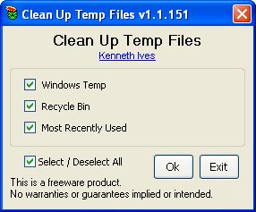



## Clean Temp  15\-Jun\-2012

### Description

There are three major areas tht require constant maintenance. They are Most recent documents, Windows temp files, and the Recycle bin.

----

15-Jun-2012 Updated documentation and support modules.
 
### More Info
 

             |
---                |---
**Submitted On**   |2012-06-14 18:38:08
**By**             |[Kenaso](https://github.com/Planet-Source-Code/PSCIndex/blob/master/ByAuthor/kenaso.md)
**Level**          |Beginner
**User Rating**    |4.9 (34 globes from 7 users)
**Compatibility**  |VB 6\.0
**Category**       |[Complete Applications](https://github.com/Planet-Source-Code/PSCIndex/blob/master/ByCategory/complete-applications__1-27.md)
**World**          |[Visual Basic](https://github.com/Planet-Source-Code/PSCIndex/blob/master/ByWorld/visual-basic.md)
**Archive File**   |[Clean\_Temp2224966152012\.zip](https://github.com/Planet-Source-Code/kenaso-clean-temp-15-jun-2012__1-73490/archive/master.zip)

